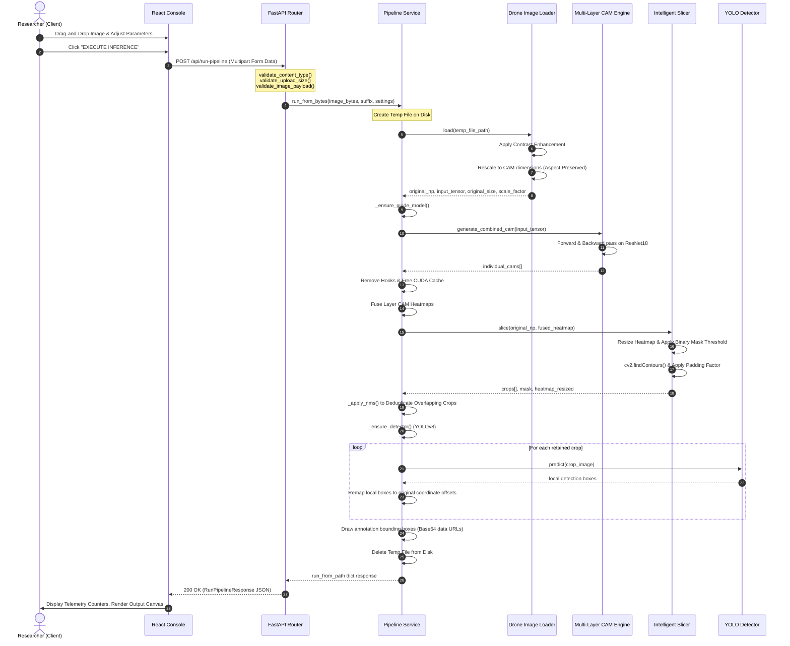

# Data Flow & Lifecycle

This document traces the request-response flow of an image upload through the Searchlight Protocol system.

## 🔄 End-to-End Sequence Diagram

The diagram below details the chronological method calls, network boundaries, and file system interactions that occur when a user executes a run in the dashboard:

## 📦 Payload Schemas

### 1. Request Parameters (Multipart Form)
*   `image`: Binary file payload (JPEG, PNG, TIFF).
*   `padding_factor` (Float, Default: `0.4`): Relative boundary padding.
*   `heatmap_threshold` (Float, Default: `0.4`): Cutoff for activation region selection.
*   `yolo_confidence` (Float, Default: `0.3`): YOLO confidence score.
*   `min_crop_size` (Int, Default: `120`): Minimum resolution floor for crop slicing.
*   `nms_iou_threshold` (Float, Default: `0.2`): Overlap index for crop-level suppression.

### 2. Response Payload (JSON)
The response is structured into distinct, self-contained sections:
*   `meta`: Execution hardware and version specs.
*   `settings`: Echoes the hyperparameters used for the run.
*   `counts`: Performance metrics (total pre-nms crops, post-nms crops, detections).
*   `research`: Timing profiles (in milliseconds) and detection confidence scores.
*   `outputs`: Base64 PNG data URLs representing the output canvases.
*   `crops`: Array of cropped images alongside their bounding box origins.
*   `detections`: Array of remapped global coordinate bounding boxes with category names.
