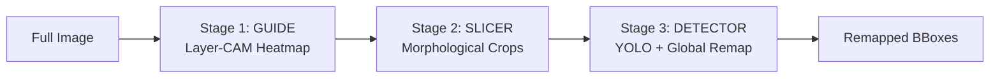

# The 3-Stage Detection Pipeline

The core value of The Searchlight Protocol lies in its coarse-to-fine aerial intelligence pipeline. Aerial drone images are characterized by very high resolutions (e.g., 4K or 8K) and extremely small targets. Running high-resolution batch detectors across standard overlapping sliding-window grids is prohibitively slow. 

The pipeline addresses this by utilizing a lightweight "Guide" classifier to filter out empty background regions first, passing only target-dense crops to the "Detector" network.

---

## 🧭 Stage 1: The Guide (LayerCAM)

Stage 1 ingests the downscaled full-resolution image and generates a spatial attention map representing potential target presence.

### 1. Backbone Architecture
By default, the pipeline initializes a **ResNet18** model pretrained on ImageNet-1K. It attaches hooks to capture features at multiple depths:
*   `layer2[-1]` (low-level structural bounds)
*   `layer3[-1]` (intermediate geometric patterns)
*   `layer4[-1]` (high-level semantic abstractions)

### 2. LayerCAM Formulation
Unlike standard Grad-CAM, which uses global average pooled gradients, Layer-CAM uses positive gradients at each spatial location to weight corresponding activations. For a layer activation $A$ with dimensions $C \times H \times W$ and target class score $y$:

$$\alpha_{c, i, j} = \text{ReLU}\left(\frac{\partial y}{\partial A_{c, i, j}}\right)$$

$$L_{\text{LayerCAM}, i, j} = \text{ReLU}\left(\sum_{c} \alpha_{c, i, j} \cdot A_{c, i, j}\right)$$

This allows the preservation of fine spatial contours in earlier convolutional layers.

### 3. Multi-Layer Heatmap Fusion
The maps from each target layer are individually resized, normalized, and aggregated using predefined linear fusion weights:

$$M_{\text{Fused}} = \frac{0.7 \cdot M_{\text{layer2}} + 0.9 \cdot M_{\text{layer3}} + 1.0 \cdot M_{\text{layer4}}}{0.7 + 0.9 + 1.0}$$

---

## ✂️ Stage 2: The Slicer (Intelligent Slicing)

Stage 2 transforms the fused, continuous heatmap into distinct, padded sub-image crops.

### 1. Binary Thresholding
The fused heatmap is resized back to the original image dimensions. Activations are thresholded to isolate region boundaries:

$$T(x,y) = \begin{cases} 255 & \text{if } M_{\text{Fused}}(x,y) > \theta_{\text{threshold}} \\ 0 & \text{otherwise} \end{cases}$$

### 2. Contour Extraction
Contiguous active clusters are extracted using OpenCV's topological contour-finding algorithm (`cv2.findContours` with retrieval mode `cv2.RETR_EXTERNAL`).

### 3. Context Padding & Boundary Constraints
For each bounding rectangle $(x, y, w, h)$ extracted, contextual padding is added:

$$\text{pad}_{x} = w \cdot \text{factor}_{\text{padding}}, \quad \text{pad}_{y} = h \cdot \text{factor}_{\text{padding}}$$

This ensures shape information is not clipped at crop edges. To prevent tiny crops that fail to feed YOLO effectively, a `min_crop_size` parameter forces crops below a certain size (e.g. 120 pixels) to expand symmetrically. Finally, bounding boxes are clamped to the image dimensions:

$$x_1 = \max(0, x - \text{pad}_{x}), \quad y_1 = \max(0, y - \text{pad}_{y})$$
$$x_2 = \min(\text{width}, x + w + \text{pad}_{x}), \quad y_2 = \min(\text{height}, y + h + \text{pad}_{y})$$

### 4. Crop Non-Maximum Suppression (NMS)
To prevent heavily overlapping crops from generating redundant YOLO inference workloads, a crop-level NMS step is performed using PyTorch torchvision operators based on the average activation score inside each region.

---

## 🔍 Stage 3: The Detector (YOLO)

Stage 3 executes high-fidelity object detection exclusively on the extracted, downscaled candidate sub-images.

### 1. YOLO Inference
Each crop is fed to an Ultralytics YOLO detector (typically YOLOv8n) with test-time augmentation (TTA) and class-agnostic NMS enabled.

### 2. Global Coordinate Remap
Because YOLO outputs coordinates relative to the crop boundary, they must be projected back to the original global frame. For a detection inside crop $i$ with crop coordinates $(x_{c,i}, y_{c,i})$, local prediction $(x_1, y_1, x_2, y_2)$ is translated:

$$x_{1,\text{global}} = x_1 + x_{c,i}$$
$$y_{1,\text{global}} = y_1 + y_{c,i}$$
$$x_{2,\text{global}} = x_2 + x_{c,i}$$
$$y_{2,\text{global}} = y_2 + y_{c,i}$$

### 3. Final Fusion
Remapped global bounding boxes are collected and prepared for API response payload serialization.
