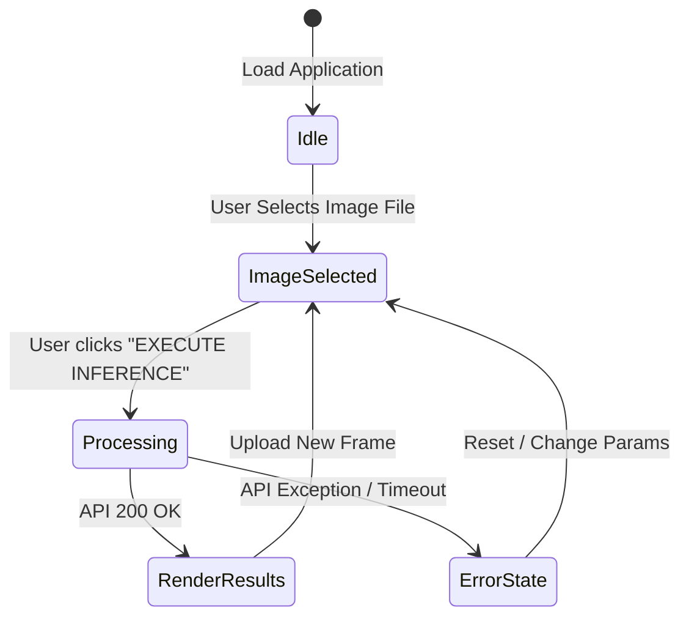

# Frontend Console Overview

The frontend dashboard console of **The Searchlight Protocol** provides a modern, dark-themed tactical research interface. It is built as a Single Page Application (SPA) using React, Vite, Framer Motion, and Tailwind CSS.

---

## 📂 React Source Tree

```
webapp/frontend/src/
├── main.jsx                 # Entry mounting node
├── App.jsx                  # Main wrapper coordinating request state
├── App.css                  # Custom keyframes and radar sweeps styling
├── index.css                # Tailwind base directives and custom components tokens
└── components/
    ├── HeroSection.jsx      # Stage graph visualization header
    ├── ResearchConsole.jsx  # Input uploading and hyperparameter control sliders
    ├── ResultsPanel.jsx     # Tabbed rendering canvas for outputs
    ├── MetricsPanel.jsx     # Telemetry dashboard
    └── ui/
        ├── CornerFrame.jsx  # Styled sci-fi grid block wrapper
        └── MicroLabel.jsx   # Micro-typographical label
```

---

## ⚡ Client State Coordination

The root `App.jsx` component maintains the primary state machine for the application session:



### State Fields:
*   `imageFile` (`File | null`): Holds reference to the uploaded tactical frame file.
*   `params` (`Object`): Map of hyperparameters passed down to `ResearchConsole` sliders.
*   `loading` (`Boolean`): Toggles global backdrop loader spinners.
*   `results` (`RunPipelineResponse | null`): Stores JSON payload output on success.
*   `error` (`String | null`): Captures failure context alerts.
