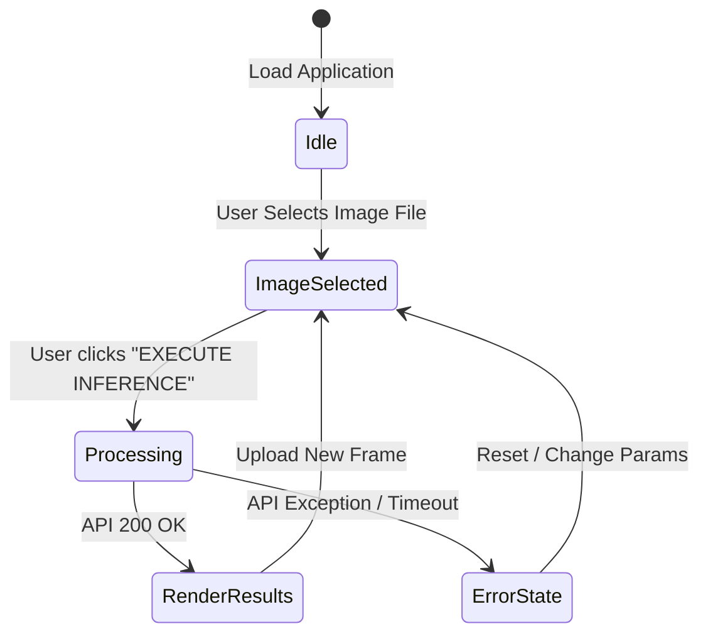

# Frontend Console Overview

The frontend dashboard console of **The Searchlight Protocol** provides a dark tactical research interface. It is built as a single-page application using React, Vite, Framer Motion, and Tailwind CSS.

---

## React Source Tree

```text
webapp/frontend/src/
|-- main.jsx                 # Entry mounting node
|-- App.jsx                  # Main wrapper coordinating request state
|-- index.css                # Tailwind base directives and custom component tokens
`-- components/
    |-- HeroSection.jsx      # Stage graph visualization header
    |-- ResearchConsole.jsx  # Input upload and hyperparameter sliders
    |-- ResultsPanel.jsx     # Tabbed rendering canvas for outputs
    |-- MetricsPanel.jsx     # Telemetry dashboard
    `-- ui/
        |-- CornerFrame.jsx  # Styled grid block wrapper
        `-- MicroLabel.jsx   # Micro-typographical label
```

Fonts are loaded from `index.html` with preconnect hints rather than CSS `@import` so browser discovery starts earlier.

---

## Client State Coordination

The root `App.jsx` component maintains the primary state machine for the application session:



### State Fields

* `imageFile` (`File | null`): Holds the uploaded tactical frame.
* `params` (`Object`): Hyperparameters passed to `ResearchConsole` sliders.
* `loading` (`Boolean`): Toggles global processing state.
* `result` (`RunPipelineResponse | null`): Stores JSON payload output on success.
* `error` (`String`): Captures failure context alerts.

The frontend requests the backend `display` response profile, which preserves the rendered tabs and crop samples while avoiding the full diagnostic image payload.
